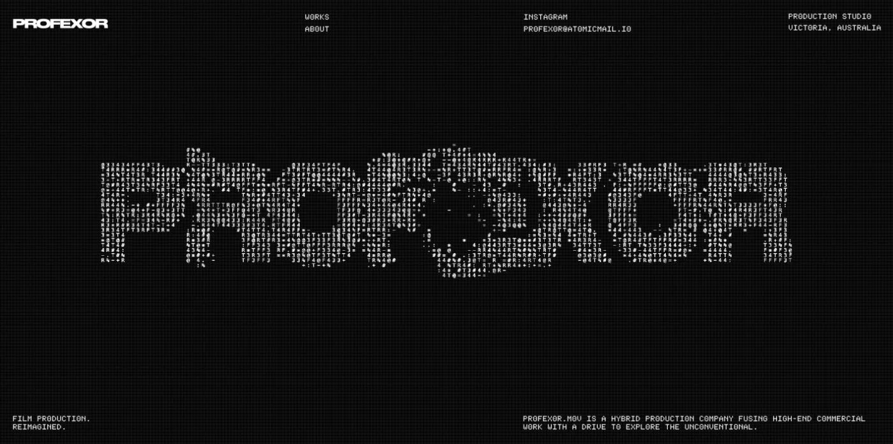
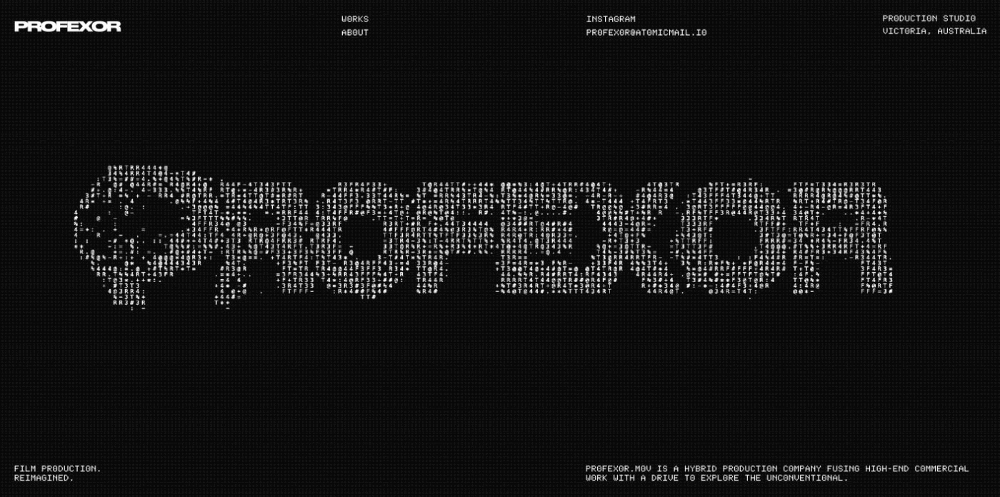
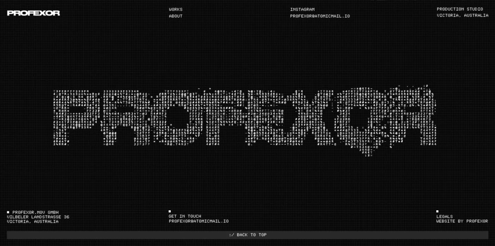
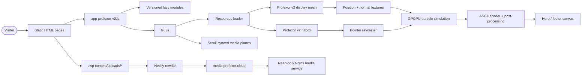
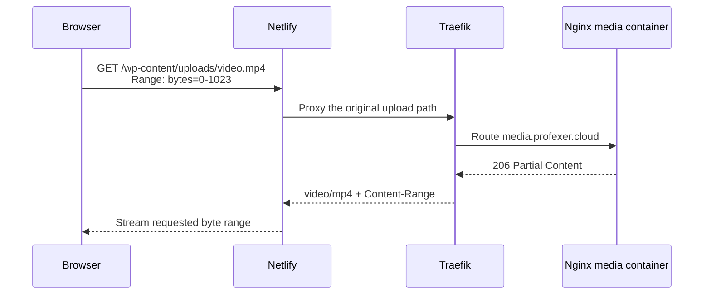

<div align="center">
  <h1>PROFEXOR</h1>
  <p><strong>Film production. Reimagined.</strong></p>
  <p>
    A cinematic production-studio portfolio built as a fast static site with a
    GPU-driven, mouse-reactive ASCII particle identity.
  </p>
  <p>
    <a href="https://profexor.netlify.app/">
      
    </a>
    
    
  </p>
  <p>
    <a href="https://profexor.netlify.app/">Live experience</a>
    ·
    <a href="#architecture">Architecture</a>
    ·
    <a href="#run-locally">Run locally</a>
    ·
    <a href="#profexor-wordmark-pipeline">3D pipeline</a>
  </p>
</div>

<a href="https://profexor.netlify.app/">
  
</a>

## Experience

Profexor is a multi-page production portfolio where typography, moving image,
scroll choreography, and realtime graphics share one visual system. The site is
shipped as static HTML and immutable production assets, while its central
identity is rendered by a custom Three.js/GPGPU engine.

| Experience layer | What it delivers |
|---|---|
| **Interactive identity** | A densely remeshed `PROFEXOR` wordmark filled with flickering ASCII characters and displaced by pointer movement. |
| **Cinematic portfolio** | A selected-work landing page, complete portfolio index, individual case studies, and studio information. |
| **Motion system** | GSAP and ScrollTrigger coordinate text reveals, page transitions, media planes, and WebGL state. |
| **Static delivery** | Standalone HTML pages and a versioned JavaScript module graph deploy directly to Netlify. |
| **Dedicated media origin** | Large images and video stream through the site path from a read-only Nginx origin behind Traefik. |

<details>
  <summary><strong>▶ Watch the wordmark react to pointer movement</strong></summary>
  <br>
  
</details>

<details>
  <summary><strong>▶ See the shared footer identity</strong></summary>
  <br>
  
</details>

## Highlights

- **GPU particle simulation** — model positions and normals become textures
  consumed by `GPUComputationRenderer` every frame.
- **Two-mesh interaction model** — a dense display mesh preserves the character
  field while a lightweight hitbox keeps raycasting responsive.
- **Correct face topology** — the generator preserves eight letter faces and the
  five counters belonging to P, the two Rs, and the two Os.
- **ASCII post-processing** — custom shader passes translate the particle field
  into the changing letters, numbers, and symbols that define the experience.
- **Reusable hero and footer runtime** — the same identity system is registered
  in both placements and responds to pointer proximity.
- **Immutable deployment graph** — the entry module, lazy chunks, and GLB files
  use coordinated versioned names so long-lived edge caching stays safe.
- **Byte-range video delivery** — Netlify proxies upload requests to the media
  origin while preserving `206 Partial Content` playback.

## Architecture

The code graph confirms the runtime path from the static page through the
compiled module graph into `GL.js`, `Resources`, and the particle engine. The
model geometry then feeds position/normal textures, while the low-poly mesh is
reserved for pointer raycasting.



### Runtime responsibilities

| Component | Responsibility |
|---|---|
| `index.html`, `about/`, `works/`, `work/`, `legals/` | Semantic page shells and content entry points. |
| `public/build/assets/app-profexor-v2.js` | Production entry module and lazy-module coordinator. |
| `resources/js/GL/GL.js` | Renderer, scene lifecycle, resources, media planes, and shared effects. |
| `resources/js/GL/Resources.js` | Loads the versioned display and hitbox GLBs. |
| `resources/js/GL/utils/Artefakt.js` | Internal legacy filename for the GPGPU identity engine, raycaster, particles, and post-processing. |
| `tools/profexor-model/` | Deterministic font-to-GLB generation, topology tests, mesh validation, and bundle integration. |
| `_redirects` + `ops/media-origin/` | Same-origin media URLs, edge proxying, and the reproducible media service. |

## Profexor wordmark pipeline

The animation engine did not need replacing. The production correction was
made at the geometry and delivery layers: remesh the actual letter faces,
preserve counters, weight tessellation toward the visible planes, and publish
the pair under new immutable names.

```mermaid
flowchart LR
  font[Bundled Druk Wide WOFF2] --> path[OpenType path]
  path --> winding[Contour winding + counter checks]
  winding --> extrude[Extruded PROFEXOR geometry]
  extrude --> fit[Fit original runtime bounds]
  fit --> remesh[Face-weighted tessellation]
  remesh --> display[High-density display GLB]
  remesh --> hitbox[Low-density hitbox GLB]
  display --> validate[Topology + density + bounds validation]
  hitbox --> validate
  validate --> version[Immutable v2 filenames]
  version --> integrate[Rewrite reachable module graph]
  integrate --> deploy[Netlify production]
```



### Validated v2 geometry

| Model | Positions | Triangles | Visible front points | File size | Purpose |
|---|---:|---:|---:|---:|---|
| `profexor-wordmark-v2.glb` | 104,986 | 193,448 | 43,769 unique | 4.84 MB | Particle/effect source mesh |
| `profexor-wordmark-hitbox-v2.glb` | 8,588 | 10,568 | 1,875 unique | 271 KB | Pointer raycasting |

The generator rejects regressions in bounds, edge length, density, topology,
index count, degenerate triangles, and output size. A font-level regression test
also asserts exactly eight outer shapes and five counters.

## Media delivery

Large uploads are intentionally absent from Git. Production requests retain
their original `/wp-content/uploads/...` paths and are rewritten at the Netlify
edge to `media.profexer.cloud`.



The media container mounts only the upload library, read-only, and restarts
unless stopped. Operational details live in
[`ops/media-origin/README.md`](ops/media-origin/README.md).

## Repository map

```text
.
├── .github/readme/                 # README screenshots and interaction demo
├── about/                          # Studio page
├── legals/                         # Legal and privacy page
├── ops/media-origin/               # Nginx/Traefik media service definition
├── tools/profexor-model/           # Deterministic wordmark model toolchain
├── work/                           # Individual production case studies
├── works/                          # Portfolio index
├── wp-content/
│   └── themes/gl/
│       ├── public/build/assets/    # Compiled CSS and versioned JS modules
│       └── resources/
│           ├── favicon/            # Favicons and web manifest
│           └── js/GL/              # Three.js runtime, shaders, models, DRACO
├── _redirects                      # Netlify media-origin proxy
├── index.html                      # Home page
├── netlify.toml                    # Publish and immutable-cache headers
└── robots.txt
```

## Run locally

The repository is already a production-ready static build.

### Fast static preview

```sh
python3 -m http.server 8080
```

Open <http://localhost:8080>. WebGL must be served over HTTP rather than
`file://`. Repository-hosted interface assets and the Profexor models will work;
upload-backed portfolio media requires either a local upload mirror or a server
that applies the Netlify rewrite.

### Full media-aware preview

```sh
npx netlify-cli dev
```

This serves the static site while applying `_redirects`, so upload paths resolve
through the production media origin.

## Regenerate the wordmark

Run the model tool from its own package directory:

```sh
cd tools/profexor-model
npm ci
npm test
npm run generate
npm run integrate
```

| Command | Result |
|---|---|
| `npm test` | Verifies OpenType contours, counters, bounds fitting, and geometry inspection. |
| `npm run generate` | Builds both versioned GLBs and validates their production limits. |
| `npm run validate` | Re-opens the committed GLBs and checks their mesh names, topology, bounds, and size. |
| `npm run integrate` | Creates the immutable entry/lazy-module graph and updates every HTML module reference. |

See [`tools/profexor-model/README.md`](tools/profexor-model/README.md) for
implementation details and rollback rules.

## Deployment and verification

Netlify publishes the repository root. JavaScript, CSS, fonts, and GLBs receive
one-year immutable cache headers, which is why every changed production graph
uses new filenames.

Useful post-deployment checks:

```sh
# Confirm the display model is available.
curl -I https://profexor.netlify.app/wp-content/themes/gl/resources/js/GL/sources/profexor-wordmark-v2.glb

# Confirm byte-range video playback through Netlify.
curl -sS -H 'Range: bytes=0-1023' -D - -o /dev/null \
  https://profexor.netlify.app/wp-content/uploads/2026/02/Website-Film_P0066_McDonalds-1_compressed.mp4
```

Expected media response: `206 Partial Content`, `Content-Type: video/mp4`, and a
valid `Content-Range` header.

## Documentation

- [`wp-content/themes/gl/resources/js/GL/README.md`](wp-content/themes/gl/resources/js/GL/README.md) — WebGL runtime and shaders
- [`tools/profexor-model/README.md`](tools/profexor-model/README.md) — Profexor mesh generation and validation
- [`ops/media-origin/README.md`](ops/media-origin/README.md) — production media service
- [`wp-content/README.md`](wp-content/README.md) — compiled theme and asset layout
- [`work/README.md`](work/README.md) — case-study directory index

## Credit

<div align="center">
  <p>
    <strong>Designed, engineered, and maintained by Profexor.</strong><br>
    Victoria, Australia
  </p>
  <p>
    <a href="https://profexor.netlify.app/">Website</a>
    ·
    <a href="https://instagram.com/profexor.mov">Instagram</a>
    ·
    <a href="mailto:profexor@atomicmail.io">profexor@atomicmail.io</a>
  </p>
</div>
