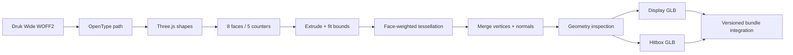

# Profexor wordmark toolchain

This package deterministically generates and validates the two versioned meshes
used by the Profexor ASCII particle identity.

| Output | Runtime role |
|---|---|
| `profexor-wordmark-v2.glb` | Dense display geometry used to create particle position and normal textures. |
| `profexor-wordmark-hitbox-v2.glb` | Lightweight collision geometry used by the pointer raycaster. |

Both models use the bundled Druk Wide font and retain the exact world-space
bounds expected by the existing Three.js animation engine. The legacy models
remain available as rollback assets.

## Why the v2 remesh exists

The first generated Profexor mesh inverted the font contour interpretation. It
treated counter/background regions as solid and devoted most subdivisions to
the thin extrusion walls, leaving too few particles across the visible letter
faces.

The v2 pipeline fixes both causes:

1. OpenType contours are converted with the correct post-Y-flip winding.
2. `PROFEXOR` must resolve to eight outer shapes and five counters.
3. Tessellation temporarily compresses the Z axis so subdivisions favor the
   visible front/back planes.
4. The original Z scale and exact runtime bounds are restored before export.
5. Separate density limits protect the display mesh and raycast hitbox.



## Reproducible workflow

Run from this directory:

```sh
npm ci
npm test
npm run generate
npm run integrate
```

| Command | What it checks or changes |
|---|---|
| `npm test` | Font contours/counters, asymmetric bounds fitting, and finite indexed geometry inspection. |
| `npm run generate` | Generates both GLBs, enforces configuration limits, writes them to the runtime source directory, then validates them again after export. |
| `npm run validate` | Loads the committed GLBs and checks mesh names, counts, bounds, edge lengths, degenerate triangles, and byte limits. |
| `npm run integrate` | Copies the complete reachable production module graph to immutable v2 names and updates all HTML preload/script references. |

## Current validated geometry

| Metric | Display mesh | Hitbox |
|---|---:|---:|
| Positions | 104,986 | 8,588 |
| Unique positions | 96,730 | 5,290 |
| Triangles | 193,448 | 10,568 |
| Unique front-plane positions | 43,769 | 1,875 |
| Maximum visible-plane edge | 0.03999 | 0.24961 |
| File size | 4,842,096 bytes | 270,564 bytes |

Limits are defined in `model-config.mjs`. Generation fails if topology,
density, edge length, bounds, finite values, index counts, degenerate triangles,
or output size fall outside those checked ranges.

## Immutable bundle integration

The production site gives JavaScript and GLB assets one-year immutable cache
headers. Replacing bytes at an existing URL would therefore leave some visitors
on stale geometry or a mixed module graph.

`npm run integrate` instead:

1. starts at the canonical compiled entry module;
2. traverses every reachable static and lazy import;
3. copies the full graph to coordinated `-profexor-v2.js` names;
4. replaces the legacy GLB paths with the v2 model paths; and
5. updates every HTML `modulepreload` and script reference.

The integration check currently expects 25 versioned modules across 24 HTML
files and 46 entry-module references. Keeping the whole graph on one version
also prevents duplicate Three.js runtimes.

## Key files

| File | Purpose |
|---|---|
| `model-config.mjs` | Text, names, bounds, tessellation controls, and validation limits. |
| `geometry.mjs` | OpenType conversion, fitting, remeshing, inspection, and assertions. |
| `geometry.test.mjs` | Regression tests, including face/counter orientation. |
| `generate.mjs` | Font loading, GLB export, and generation reports. |
| `validate.mjs` | Post-export GLB validation. |
| `sync-production-bundle.mjs` | Immutable reachable-module graph integration. |

## Versioning rule

Never overwrite a production model or module graph under an already immutable
URL. For the next geometry change, increment the model, mesh, bundle, and chunk
version together; update both runtime resources; regenerate; integrate; and
browser-test the hero and footer before production deployment.

Maintained by **Profexor**.
