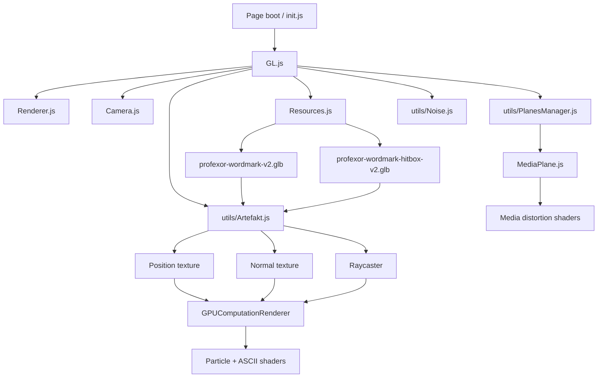

# Profexor WebGL runtime

Custom Three.js engine powering the Profexor particle wordmark, scroll-synced
media planes, background texture, and post-processing effects.

## Runtime graph



`Artefakt.js` is retained as an internal legacy filename because the working
engine, shader bindings, and object keys depend on it. The public identity and
loaded production geometry are Profexor.

## Directory structure

```text
GL/
├── GL.js                         # Main scene and subsystem coordinator
├── Camera.js                     # Perspective/orthographic camera handling
├── Renderer.js                   # WebGL renderer configuration
├── Resources.js                  # Versioned Profexor GLB definitions
├── utils/
│   ├── Artefakt.js               # GPGPU identity engine and raycaster
│   ├── PlanesManager.js          # Scroll-synced media-plane lifecycle
│   ├── MediaPlane.js             # Video/image plane and transitions
│   ├── Plane.js                  # Base plane geometry
│   ├── DistortionTexture.js      # Pointer/scroll distortion texture
│   └── Noise.js                  # Background noise effect
├── shaders/
│   ├── artefakt/                 # Identity particle/render shaders
│   ├── gpgpu/                    # Particle-position computation
│   ├── media-plane/              # Media distortion shaders
│   ├── plane/                    # Base plane shaders
│   └── noise/                    # Background texture shaders
├── sources/                      # GLB meshes
├── draco/                        # DRACO decoder and WASM assets
├── addon.js                      # Upstream build injection map
└── init.js                       # Shader-source build utility
```

## Identity lifecycle

1. `GL.js` creates the renderer, cameras, shared resources, and the identity
   subsystem.
2. `Resources.js` loads the display and hitbox meshes.
3. The display mesh becomes base-position and base-normal data textures.
4. `GPUComputationRenderer` updates the particle positions on the GPU.
5. The hitbox is registered with a raycaster so pointer proximity can alter the
   simulation without raycasting against the full display mesh.
6. Particle shaders and post-processing render the changing ASCII characters.
7. Page state switches the same runtime between hero and footer placements.

## Production models

| File | Description |
|---|---|
| `sources/profexor-wordmark-v2.glb` | Face-weighted, high-density Profexor display mesh. |
| `sources/profexor-wordmark-hitbox-v2.glb` | Lower-density Profexor collision/raycast mesh. |
| `sources/profexor-wordmark-v1.glb` | Previous Profexor display model retained for rollback. |
| `sources/profexor-wordmark-hitbox-v1.glb` | Previous Profexor hitbox retained for rollback. |
| `sources/artefakt.glb` | Legacy source model retained for rollback/reference; not loaded by production. |
| `sources/artefakt-low-poly.glb` | Legacy hitbox retained for rollback/reference; not loaded by production. |
| `sources/a.glb` | Alternate letter model used by the existing runtime. |
| `sources/face-lowpoly.glb` | Low-poly face geometry. |
| `sources/daniel.glb`, `jan.glb`, `lukas.glb` | Existing team-related model assets. |

The Profexor mesh pair is generated and validated by
[`tools/profexor-model/`](../../../../../../tools/profexor-model/README.md).

## Key techniques

- **GPGPU simulation** — per-frame particle positions via
  `GPUComputationRenderer` and custom flow-field logic.
- **Pointer interaction** — low-density raycast geometry drives local particle
  displacement on desktop.
- **ASCII post-processing** — custom shader passes convert the identity into a
  grid of changing characters.
- **Scroll orchestration** — GSAP ScrollTrigger coordinates scene state with DOM
  motion and page sections.
- **Media planes** — videos and images are projected into WebGL planes with
  shader distortion and scroll synchronization.
- **DRACO support** — compressed GLB assets can be decoded through the bundled
  decoder.
- **Responsive lifecycle** — expensive media-plane effects are reduced or
  destroyed when mobile state requires a lighter path.

## Build note

`init.js` and `addon.js` belong to the upstream shader-injection workflow. The
repository already contains the compiled production module graph; no source
rebuild is required to serve the static site.

When changing the Profexor meshes, use the deterministic model toolchain rather
than editing compiled modules directly. It coordinates the GLB filenames with
the complete immutable JavaScript graph.

Maintained by **Profexor**.
